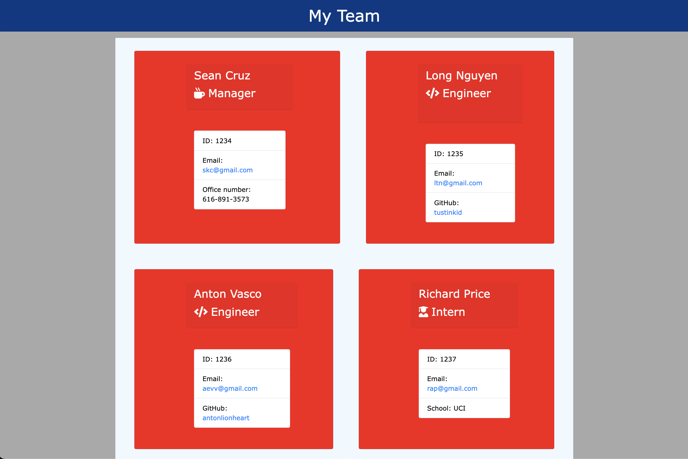

## <h1> Team Generator </h1>
## <h2> Description </h2>

 This is a <code>node.js</code> application that creates a team roster for a user that wants to have a useful application that stores a team's name, contact and general information. 

## <h2> Table of Contents </h2>

Table of Contents

<ol>
<li><a href='#installation'>Installation</a></li>
<li><a href='#usage'>Usage</a></li>
<li><a href='#contribution'>Contribution</a></li>
<li><a href='#tests'>Tests</a></li>
<li><a href='#questions'>Questions</a></li>

## <h3 id='installation'>Installation</h3>

 Clone this repo to your device and then run the command <code>npm i</code> in your terminal. 

## <h3 id='usage'>Usage</h3>

 To use this application, run the command <code>node app.js</code> in your terminal. You will then be asked to enter your team's information. Once you have added every member of your team, your team roster will be generated as a team.html file in the output folder that can be opened in your default browser. 

## <h3 id='contributing'>Contributing</h3>

 This project is considered finished. However, the questions types can be changed to fit each user's needs. If you have anything you would like to contribute, please contact me. You can find my contact information below in the <a href='#questions'>Questions</a> section. 

## <h3 id='testing'>Tests</h3>

 To test, you can run the command <code>npm run test</code> in your terminal. As it stands, this application passes all tests. 

## <h3 id='questions'>Questions</h3>

Have questions? Please feel free to reach out to me on github at skcruzer or by email at seankennethcruz@gmail.com 

    